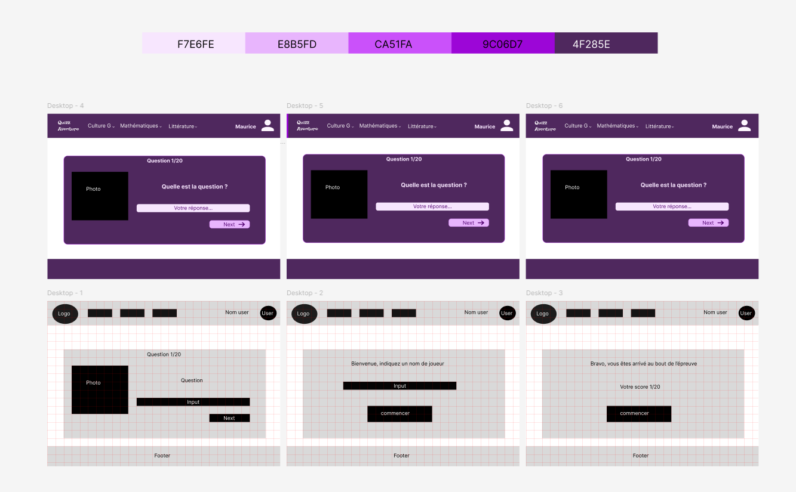

# React + Vite
# Front ecf juillet 2024
### Pour démarrer le projet

Vous devez utiliser ces commandes :

````text
  cd ecf-front
  npm install
  npm run dev
````

Le projet front tourne sur le port 5173.


J'ai décidé d'utiliser React pour ce projet avec Vite. Pourquoi Vite ? Car il permet de gagner du temps 
au démarrage du projet.

React, car c'est une librairie JS puissante, qui permet de créer des applications fluides.

J'ai créé un wireframe et une maquette des principales pages de l'application. Comme j'ai commencé par faire le back et
que j'ai eu plusieurs problèmes lors de la conception du front et de la gestion de la liaison et récupération des infos
de la base de données, le site ne contient qu'une page unique



L'utilisateur peut donc démarrer le jeu, répondre aux questions, et en fonction de sa réponse, soit gagner un point, soit en
perdre un. Arrivé au bout des vingt questions, il peut voir son score final et recommencer la partie
s'il le souhaite.

La prochaine étape à effctuer (outre refactoriser le code qui, mauvaise gestion du temps, n'est pas du optimal) est d'implémenter
la possibilité de créer un utilisateur, de récupérer son score, de jouer. Les routes sont déjà créées côté back.
